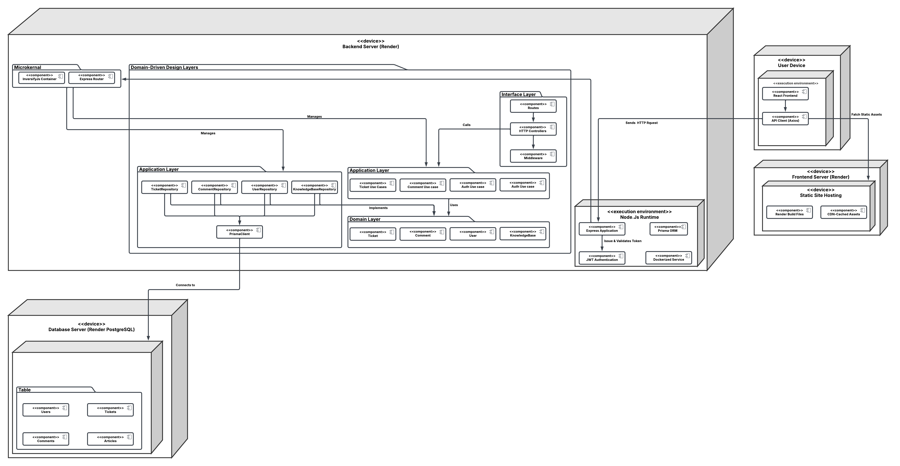

# Software Architecture Project
## Tour Manage System - Customer Support Module


## Overview
This repository contains a **full-stack application** with a **Node.js backend** and a **React frontend**. The backend follows **Domain-Driven Design (DDD)** and implements the **Microkernel Architecture** pattern, utilizing **InversifyJS** for dependency injection. The frontend is developed using **React and TypeScript** for a seamless user experience.

## Key Features
- **Microkernel Architecture** for a modular and scalable backend.
- **Domain-Driven Design (DDD)** to ensure clear separation of concerns.
- **InversifyJS** for dependency injection in the backend.
- **Prisma ORM** for database management.
- **JWT-based authentication** for security.
- **React with TypeScript** for frontend development.
- **API communication via Axios** for client-server interaction.
- **Unit testing** with Jest and Testing Library.

## Prerequisites
- **Node.js** (>= 18.x)
- **npm** (>= 8.x)
- **PostgreSQL database**

## Installation

### Clone the Repository
```sh
git clone https://github.com/24024414hariharan/TMS.git
cd TMS
```

### Backend Setup (software-architecture)
1. Navigate to the backend directory:
```sh
cd <backend-directory>
```

2. Install dependencies:
```sh
npm install
```

3. Configure environment variables:
   - Create a `.env` file with the following configurations:
```
NODE_ENV=development
PORT=<port>
JWT_SECRET=<your-secret>
DATABASE_URL=postgresql://<user>:<password>@<host>:<port>/<database>
```

4. Run database migrations:
```sh
npx prisma migrate dev --name init
```
Note: You can also run `npx prisma migrate dev` without a migration name to sync the existing migrations if they are already created.

5. Start the backend server:
```sh
npm run dev
```

### Frontend Setup (customer-support)
1. Navigate to the frontend directory:
```sh
cd <frontend-directory>
```

2. Install dependencies:
```sh
npm install
```

3. Configure environment variables:
   - Create a `.env` file with the following configuration:
```
REACT_APP_API_DOMAIN=http://localhost:<port>
```

4. Start the frontend server:
```sh
npm start
```

## Scripts

### Backend
```json
"scripts": {
  "build": "tsc",
  "start": "node dist/src/index.js",
  "dev": "ts-node-dev --respawn --transpile-only src/server.ts",
  "test": "jest"
}
```

### Frontend
```json
"scripts": {
  "start": "react-scripts start",
  "build": "react-scripts build",
  "test": "react-scripts test",
  "eject": "react-scripts eject"
}
```

## Prisma Migrations
Prisma is used to manage database schema and migrations.

### Initialize Prisma
```sh
npx prisma init
```

### Create a Migration
```sh
npx prisma migrate dev --name <migration-name>
```
Note: You can also run `npx prisma migrate dev` without a migration name to sync the existing migrations if they are already created.

### Apply Migrations
```sh
npx prisma migrate deploy
```

### Generate Prisma Client
```sh
npx prisma generate
```

### Reset Database
```sh
npx prisma migrate reset
```

## Development Workflow
- Watch Mode: Auto-recompile TypeScript files on changes
```sh
npm run dev
```

- Serve: Run the compiled JavaScript files
```sh
npm start
```

## Testing

### Backend
- Unit tests written with Jest.
- Run tests with:
```sh
npm test
```

### Frontend
- Uses React Testing Library and Jest.
- Run tests with:
```sh
npm test
```

## Contribution Guidelines
1. Fork the repository.
2. Create a new branch (`git checkout -b feature-branch`).
3. Commit changes (`git commit -m 'Add new feature'`).
4. Push to the branch (`git push origin feature-branch`).
5. Open a Pull Request.


### **System Architecture**  
Below is the architecture diagram illustrating the structure of our backend application:  

## Component Diagram
You can view the diagrams in Lucidchart:  
[Lucid Link](https://lucid.app/lucidchart/1a14c95f-0933-42aa-8fdd-8e8ea4a1db56/edit?invitationId=inv_a2805419-e6d1-41ca-96de-1a9aeb7a50ed)


## Deployment Diagram
You can view the diagrams in Lucidchart:  
[Lucid Link](https://lucid.app/lucidchart/a17bd31f-834f-4652-b4b3-5f7856ab7efc/edit?invitationId=inv_7d158303-ab0b-4685-9f1e-25b162eaaf32)




## Code Maintainers
| Name | Student ID | Batch |
| --- | --- | --- |
| Hari Haran Rathinakumar | 24024414 | 2024-25 |
